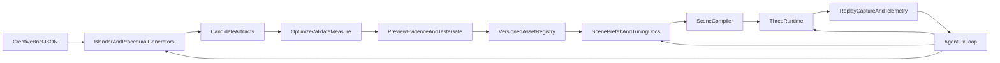

# Agentic Browser Game Studio

## Direction

Build generic contracts and tools, but prove each one immediately through Beach Buggy. A genre-neutral data and command layer is valuable; a Unity-sized generic editor before one complete production loop is not.

The repository has the right starting seams: TypeScript/Vite/Three.js, [`SceneDocument`](packages/core/src/scene.ts), an asset manifest, [`World.step`](packages/physics/src/world.ts), an import CLI, preview apps, and a Playwright smoke test. It is not yet a closed agent loop:
- the live game is variable-step and AI depends on wall time;
- physics and gameplay values are hardcoded;
- preview tools require human file pickers;
- validation is shallow;
- the smoke test boots the menu without playing or taking screenshots, and mutates live game files;
- there is no replay, telemetry, failure bundle, performance budget, or agent playbook.

## Operating model

Every write-capable module follows the same contract: `request -> artifact -> validation report -> visual/runtime evidence -> accept or reject`. The command line is the source of truth. Web tools are human taste surfaces; a later local MCP wrapper exposes the same stable commands to agents.

## Implementation plan

1. **Close the feedback loop before expanding the toolset**
   - Wire [`packages/core/src/clock.ts`](packages/core/src/clock.ts) into [`games/beach-buggy/src/main.ts`](games/beach-buggy/src/main.ts), replace wall-clock AI with simulation time, and support deterministic seed/reset/fixed-tick/input injection.
   - Add a headless simulation command that accepts a scene, tuning document, seed, and input/replay file; emit JSONL traces and a summary of lap time, lateral error, collisions, invalid values, and finish state.
   - Extend [`tools/pipeline-smoke/src/run.ts`](tools/pipeline-smoke/src/run.ts) to play scripted scenarios, capture screenshots and runtime state, assert HUD/gameplay/network/console invariants, and save a failure bundle. Stop it from rewriting [`games/beach-buggy/public/scenes/default.json`](games/beach-buggy/public/scenes/default.json) or polluting the live manifest.

2. **Create minimal, versioned studio contracts**
   - Evolve [`packages/core/src/scene.ts`](packages/core/src/scene.ts) and [`packages/core/src/assets.ts`](packages/core/src/assets.ts) into JSON-schema-backed documents for assets, prefabs, scenes, materials, transforms, colliders, behaviors, paths, spawn points, triggers, tuning, provenance, licenses, and performance budgets.
   - Add strict parsing, referential-integrity checks, deterministic IDs, canonical serialization, and migrations. Keep game-specific components under [`games/beach-buggy`](games/beach-buggy).
   - Externalize current constants from [`packages/physics/src/vehicle.ts`](packages/physics/src/vehicle.ts) and race/AI constants from [`games/beach-buggy/src/main.ts`](games/beach-buggy/src/main.ts) so agents can tune data and measure outcomes without patching code.

3. **Consolidate one agent-facing studio CLI**
   - Grow [`tools/import-cli`](tools/import-cli) into a machine-readable `studio` command surface for `asset generate/import/inspect/optimize/preview`, `scene validate/build`, `sim run`, and `game capture/test`.
   - Require JSON output, stable exit codes, explicit output directories, hashes, and no hidden writes. Add URL/query-parameter inputs to the glTF, texture, animation, and scene previews so browser automation can inspect a specific artifact.
   - Add a root agent playbook documenting the supported loops and evidence locations. Wrap commands with local MCP tools only after the CLI contracts are stable.

4. **Add reproducible Blender asset production**
   - Store Blender Python recipes plus parameter JSON as source; invoke Blender in background mode, export GLB, then optimize with glTF Transform/Meshopt and browser-appropriate texture compression.
   - Expand [`tools/import-cli/src/validate.ts`](tools/import-cli/src/validate.ts) to inspect bounds, origin, scale, orientation, triangle/draw-call/material/texture budgets, required nodes, animation/collider rules, provenance, and license metadata.
   - Produce an asset review bundle containing the GLB, `asset-report.json`, turntable/contact sheet, wireframe/bounds views, and before/after size metrics. Humans approve taste; validators enforce technical constraints.

5. **Evolve runtime and map authoring behind adapters**
   - Split [`games/beach-buggy/src/main.ts`](games/beach-buggy/src/main.ts) into lifecycle, input, simulation, rendering, audio, UI, and diagnostics systems without introducing a full ECS until entity/query complexity proves the need.
   - Keep Three.js and WebGL as the initial shipping renderer. Extend [`packages/three-render`](packages/three-render) with color management, loading, instancing, LOD, culling, resource disposal, quality tiers, debug views, and render statistics. Evaluate Three.js WebGPU only through parity and performance evidence.
   - Preserve the custom arcade vehicle model for Beach Buggy feel. Define a studio physics interface and add Rapier as the free general collision/trigger/raycast/rigid-body implementation when a slice requires those capabilities; do not replace working spline handling merely to adopt an engine.
   - Upgrade [`tools/scene-editor/src/main.ts`](tools/scene-editor/src/main.ts) to use the same commands and documents as agents: asset palette, transforms, splines, spawn/trigger/collider views, snapping, undo/redo, validation, and play-in-place. Add seeded generators for terrain, tracks, prop scattering, and vegetation.

6. **Prove the complete studio with Beach Buggy**
   - Build one reproducible buggy, one authored track section, representative props/materials, collisions, race flow, audio, and HUD exclusively through the contracts and commands above.
   - Require a fresh-checkout build, reproducible artifact hashes, deterministic replay completion, schema and asset validation, browser compatibility, and agreed frame-time/memory/draw-call/download budgets.
   - Deliver each iteration as a compact review bundle: playable URL, before/after captures, asset and performance reports, known deviations, and the small set of taste decisions requiring the captain.

## Initial technology decisions

- **Keep:** npm workspaces, TypeScript, Vite, Three.js, glTF/GLB, JSON authoring documents, Node tests, and Playwright.
- **Add:** Blender headless Python recipes, glTF Transform/Meshopt, strict schema validation, deterministic replay/telemetry, visual/performance evidence, and optionally Rapier behind an interface.
- **Defer:** multiplayer, cloud orchestration, native WebGPU-only rendering, a full ECS, a general-purpose visual scripting system, autonomous taste decisions, and a custom multi-agent framework.

