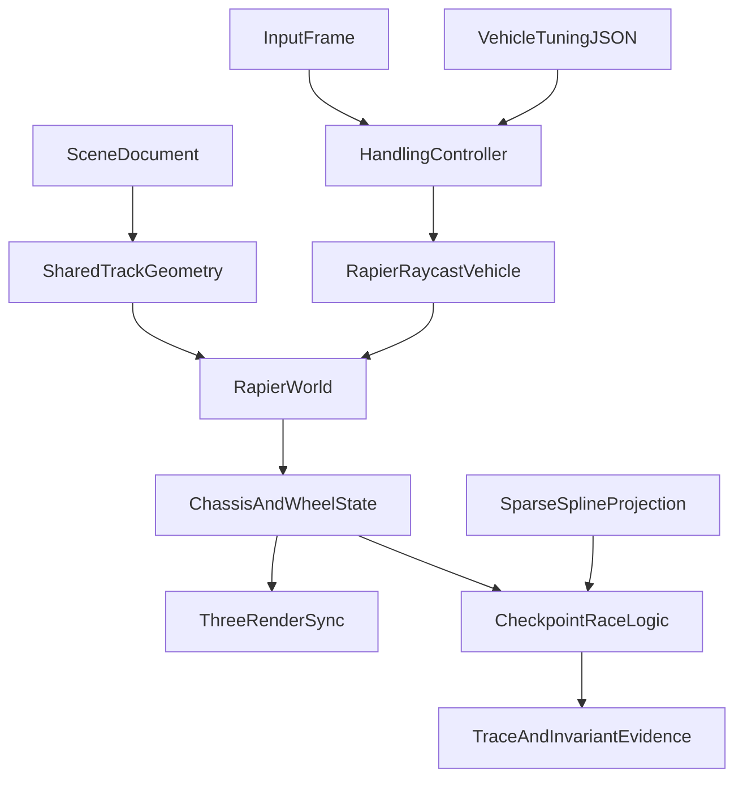

# Hybrid Vehicle Physics

## Verified decision

Use a **hybrid, mostly physics-driven** vehicle:

- **Rapier** owns rigid-body integration, gravity, chassis collision, raycast suspension, tire impulses, bumps, and trigger intersections.
- **Game code** owns steering slew and speed curves, throttle/brake mapping, boost, traction/stability assists, surface tuning, AI, and recovery.
- **The track spline** remains for AI look-ahead, checkpoint ordering, race-distance estimation, and exceptional recovery. It must not set vehicle height, push the vehicle laterally every tick, or integrate forward motion.
- Boost pads are non-solid sensors. Visual rails either get matching physical curbs or are removed in favor of sand runoff. There is no continuous centerline force disguised as “assist.”

This supersedes the old “no WASM” constraint in [`.cursor/plans/beach-buggy-local.plan.md`](.cursor/plans/beach-buggy-local.plan.md).

## Runtime flow

## Plan

### 1. Establish Rapier lifecycle without changing the live game immediately

- Add `@dimforge/rapier3d-compat` to [`packages/physics/package.json`](packages/physics/package.json). Its embedded WASM is appropriate for the current Vite and direct Node/tsx tests; use the deterministic compatibility build only if cross-platform bit-identical traces later become a requirement.
- Add idempotent `initPhysics(): Promise<void>` and async `World.create(...)`. Remove every module-level or synchronous `new World(...)` from [`games/beach-buggy/src/main.ts`](games/beach-buggy/src/main.ts), tests, and [`tools/pipeline-smoke/src/run.ts`](tools/pipeline-smoke/src/run.ts).
- Fix the simulation timestep at `1/60`. Each tick must:
  1. map inputs to wheel commands;
  2. call each vehicle controller’s `updateVehicle(fixedDt, filters)`;
  3. call the Rapier world step once with the same timestep;
  4. drain sensor/contact events;
  5. copy physics state into the public vehicle snapshots.
- Add explicit `dispose()`/`free()` behavior for controllers, event queues, and the world on restart or teardown.
- Keep the existing arcade implementation selectable during rollout. Make Rapier opt-in first and switch the game default only after parity checks pass; do not build an unnecessarily broad engine abstraction.

### 2. Implement the physical chassis and raycast wheels

- In [`packages/physics/src/vehicle.ts`](packages/physics/src/vehicle.ts), replace direct position/heading integration on the Rapier path with:
  - one dynamic chassis body and convex/cuboid collider;
  - CCD enabled;
  - four raycast wheels created with `World.createVehicleController(chassis)`;
  - self-collision exclusions for wheel queries;
  - explicit steering, engine force, braking, suspension, grip, and surface behavior.
- The handling layer remains programmatic: speed-dependent steering angle, steer slew, throttle taper near maximum speed, reverse, boost impulse/gate, optional downforce, and stability assistance.
- Move tunables into a validated vehicle document loaded by the browser and injected into `World.create` by tests/tools. Include chassis dimensions/mass, wheel offsets/radius, suspension travel/stiffness/damping, engine/brake forces, steer angle/slew, grip, speed limits, boost, and recovery thresholds.
- Treat initial values as a new model requiring tuning, not direct equivalents of today’s `ACCEL`, `DRAG`, or `STEER_RATE`.
- Rapier bodies are the source of truth. Add a `teleport`/recovery API rather than allowing tests or game code to mutate a copied `VehicleState.position`.

### 3. Build track, runoff, curbs, and sensors from shared geometry

- Extract one track-ribbon builder used by both [`games/beach-buggy/src/visuals.ts`](games/beach-buggy/src/visuals.ts) and Rapier collider construction so vertices, offsets, and winding cannot diverge.
- Begin with a stable, slightly thickened fixed road collider instead of a paper-thin strip. Add sand ground below it without coplanar overlap.
- Either create physical curb colliders matching the visible rails or remove those rails. Water should be a boundary/recovery sensor where appropriate, not an overlapping tire surface.
- Keep `boostPads` as progress fractions initially, but place both visual pads and sensor boxes with the same arc-length sampling function. Sensors require active collision events and must be excluded from wheel support rays.
- Add only the collider schema needed by this slice to [`packages/core/src/scene.ts`](packages/core/src/scene.ts), such as optional box colliders for authored props. Validate every new optional field while preserving version-1 scene compatibility.

### 4. Replace lap-wrap detection with ordered checkpoints

- Add optional checkpoint fractions to `TrackSpec`; generate 8–16 evenly spaced arc-length checkpoints when omitted.
- Advance laps only after crossing checkpoints in forward order. Reversing across the start line must never increment a lap.
- Keep spline projection in XZ for checkpoint fraction, AI targets, place/race distance, off-track telemetry, and recovery detection. Never use it to overwrite physical Y or lateral position.
- Preserve a monotonic `raceDistance` used by HUD/finish-order code in [`games/beach-buggy/src/main.ts`](games/beach-buggy/src/main.ts).
- Define recovery as an exceptional state (far off course, inverted, or stuck for a configured duration), then use the world teleport API. Do not apply hidden continuous centering.

### 5. Migrate game and rendering consumers

- Use [`packages/core/src/clock.ts`](packages/core/src/clock.ts) at fixed `1/60` with bounded catch-up steps and deliberate backlog discard.
- Replace `performance.now()` in AI decisions with simulation time and a seed. Fixed-step Rapier is locally repeatable; avoid claiming whole-game cross-platform bit determinism.
- Extend public vehicle state with quaternion rotation, derived heading/speed, checkpoint/race fields, wheel contacts, airborne time, and collision counts.
- Update [`packages/three-render/src/index.ts`](packages/three-render/src/index.ts) to copy chassis position/quaternion instead of adding fake speed pitch. Interpolate previous/current physics snapshots for smooth rendering.
- Synchronize authored wheel nodes from suspension length, steering, and wheel rotation, including asset-axis correction. Do not use the wheel contact point as the wheel center.
- Keep the loading overlay active until physics initialization and world creation finish. Ensure countdown vehicles spawn at suspension rest and do not drop unexpectedly on the first racing tick.

### 6. Build the handling feedback loop before a full studio CLI

- Replace old assertions in [`packages/physics/src/world.test.ts`](packages/physics/src/world.test.ts), especially the invisible lateral-wall test, with:
  - finite pose and forward movement after fixed ticks;
  - no spline Y snap;
  - ordered checkpoint/lap behavior including reverse crossing;
  - boost sensor activation without a chassis bump;
  - chassis collision response against a simple box;
  - recovery through the explicit teleport API.
- Add a small trace hook before the broader studio CLI: per tick record simulation time, pose, speed, slip/contact, airborne state, collisions, lap, checkpoint, race distance, and off-track distance.
- Update [`tools/pipeline-smoke/src/run.ts`](tools/pipeline-smoke/src/run.ts) to await physics initialization, assert actual displacement/state, and free the world. Stop overwriting the live default scene or polluting the live manifest.
- Add browser assertions only when the harness clicks Start and advances a race; a canvas-at-menu boot is not handling verification.

## Rollout

1. Add the dependency, async initializer/factory, fixed timestep, disposal, and arcade/Rapier flag while arcade remains default.
2. Validate one Rapier vehicle on a flat/shared track collider and compare handling traces.
3. Add physical track/runoff, boost sensors, ordered checkpoints, and single-player rendering.
4. Enable multiple racers and seeded AI; switch Beach Buggy to Rapier when lap, boost, collision, and recovery tests pass.
5. Add prop collisions, surface tuning, wheel visuals, and handling-review traces; then retire the arcade path.

## Success criteria

- The buggy exhibits weight, suspension, bumps, airborne behavior, and physical collision without invisible spline rails.
- It cannot clip visible curbs; alternatively, non-physical rails are absent.
- Boost sensors accelerate without popping the chassis.
- Reversing over start cannot increment laps, and place remains stable.
- Game, tests, and smoke use async creation, fixed `1/60`, and explicit disposal.
- Handling changes come from validated tuning data and produce comparable traces.
- The fresh browser build remains within agreed startup, frame-time, and download budgets.

